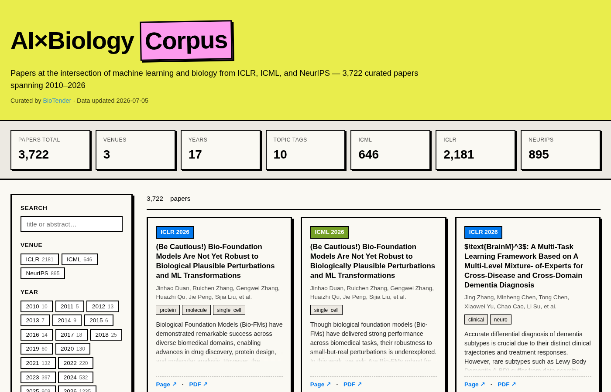
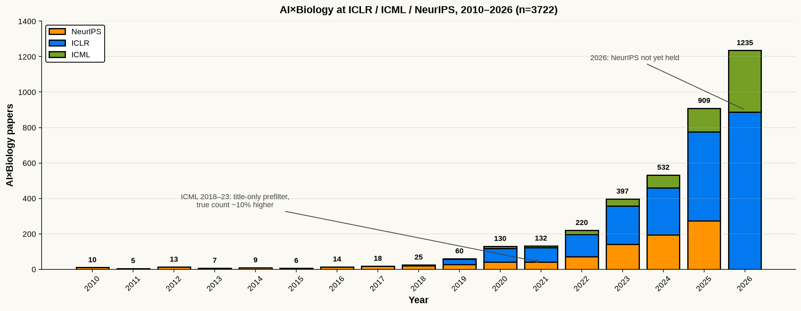
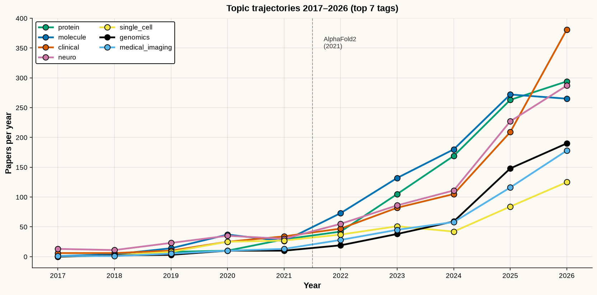

# BioTender · AI×Biology Corpus

**A curated corpus of 3,722 papers at the intersection of machine learning and
biology, published at ICLR, ICML, and NeurIPS from 2010 to 2026.**

|                        |                                                        |
|------------------------|--------------------------------------------------------|
| **Total papers**       | 3,722                                                  |
| **Venues**             | ICLR (2,181) · NeurIPS (895) · ICML (646)              |
| **Years covered**      | 2010 – 2026 (17 years, 34 venue-year combinations)     |
| **Filter recall**      | 95.9% (302/315 on ICML 2026 human-curated truth set)   |
| **Data sources**       | OpenReview · PMLR · papers.nips.cc                     |
| **License (code)**     | [MIT](LICENSE)                                         |
| **License (data)**     | [CC-BY-4.0](LICENSE-DATA)                              |
| **Curated by**         | [BioTender](https://biotender.online)                  |

<p align="center">
  
</p>

---

## Quick start

### 1. Just want to browse the papers?

Open **`biotender-ai-bio-corpus.html`** in any modern browser. It's a
self-contained single file — no server, no unzip, no build step. Everything
(filters, search, all 3,722 paper cards, tag chips) works from `file://`.

### 2. Want to modify the site (change colors, add features)?

Use the multi-file `site/` folder instead:

```bash
cd site
python3 -m http.server 8000    # or any static server
# then open http://localhost:8000
```

Files:
- `site/index.html`, `site/methodology.html` — pages
- `site/style.css` — Phylo neo-brutalist palette
- `site/app.js` — vanilla JS (filter/search/paginate)
- `site/data/papers.json`, `site/data/stats.json` — the data

### 3. Want the raw corpus for your own analysis?

```python
import json
papers = json.load(open("corpus/papers_master.json"))
print(len(papers))                  # 3722
print(papers[0].keys())             # dict_keys(['title', 'abstract', 'authors',
                                    #  'year', 'venue', 'paper_page', 'pdf_url',
                                    #  '_tags', ...])
```

Or CSV:

```bash
python3 -c "import pandas as pd; df = pd.read_csv('corpus/papers_master.csv'); print(df.head())"
```

### 4. Want to re-run the pipeline yourself?

See [`docs/METHODOLOGY.md`](docs/METHODOLOGY.md). Scripts live in `scripts/`
and only require `requests` and `beautifulsoup4`.

---

## Repository layout

```
biotender-ai-bio-corpus/
├── README.md
├── LICENSE                          MIT — covers code only
├── LICENSE-DATA                     CC-BY-4.0 — covers curation + writing
├── CHANGELOG.md                     Versioned release notes
├── .gitignore
│
├── biotender-ai-bio-corpus.html    ★ Self-contained portable site (6.1 MB)
│
├── corpus/
│   ├── papers_master.json           Full corpus (8.2 MB)
│   └── papers_master.csv            Same corpus as CSV (1.3 MB)
│
├── site/                            Multi-file interactive browser
│   ├── index.html
│   ├── methodology.html
│   ├── style.css
│   ├── app.js
│   └── data/
│       ├── papers.json              Compact schema (6.4 MB)
│       └── stats.json               Aggregate counts (1.6 KB)
│
├── scripts/                         Reproducible pipeline
│   ├── fetch_openreview_v3.py       OpenReview API v3 crawler
│   ├── filter_pipeline.py           Locked filter (v3, 95.9% recall)
│   ├── build_master.py              Merge + dedup all sources into master
│   └── build_site_data.py           Master → compact site JSON
│
├── article/
│   └── article_cn.md                中文长文 (2,356 汉字)
│
├── docs/
│   └── METHODOLOGY.md               Full pipeline description
│
├── figures/
│   ├── corpus_overview.{png,svg}    Stacked bar chart by year × venue
│   └── topic_trajectories.{png,svg} Top-7 topic tag trajectories 2017–2026
│
└── screenshots/                     Site preview images
    ├── site_default.png
    ├── site_filter_2026.png
    ├── site_search_protein.png
    ├── site_full_page.png
    ├── single_file_default.png
    └── single_file_protein.png
```

---

## What's in the corpus

### Growth over time

<p align="center">
  
</p>

```
year     ICLR    ICML   NeurIPS   TOTAL
2010                        10      10
2015                         6       6
2018             4          21      25
2020      75    13          42     130
2022     126    23          71     220
2023     217    39         141     397
2024     264    73         195     532
2025     501   134         274     909
2026     887   348           -   1,235
```

**Key inflection points:**

- **2018 → 2019**: 25 → 60 (2.4×). ICLR joins the party.
- **2019 → 2020**: 60 → 130 (2.17×). Post-AlphaFold1 ramp.
- **2022 → 2023**: 220 → 397 (1.80×). AlphaFold2 aftershock hits ICML/NeurIPS.
- **2024 → 2025**: 532 → 909 (1.71×). Foundation-model wave (scGPT, GenomicFM,
  BioFM, protein language models).
- **2025 → 2026 (ICLR + ICML only)**: 909 → 1,235.

### Topic trajectories

<p align="center">
  
</p>

- **protein**: 2 (2018) → 42 (2022) → 105 (2023, AlphaFold2 aftershock) → 294
  (2026). Textbook exponential.
- **genomics**: 19 (2022) → 148 (2025) — 2024→2025 nearly doubles (59 → 148),
  driven by DNA foundation models.
- **single_cell**: 2 (2018) → 25 (2020) → 125 (2026). Late-late explosion.
- **medical_imaging**: 10 (2020) → 178 (2026). 18× over six years.
- **clinical**: 25 (2020) → 381 (2026). 15× over six years.

Full tag frequency table:

| tag              | count |
|------------------|-------|
| molecule         | 1,005 |
| protein          | 925   |
| clinical         | 925   |
| neuro            | 916   |
| genomics         | 480   |
| medical_imaging  | 465   |
| single_cell      | 401   |
| md_structbio     | 286   |
| oncology         | 188   |
| immuno           | 91    |

*(Papers can carry multiple tags; sum > total papers.)*

---

## Data schema

Each entry in `corpus/papers_master.json` looks like:

```json
{
  "title": "AlphaFold-derived Attention for Rare Protein Fold Prediction",
  "abstract": "We propose ...",
  "authors": ["Alice Zhang", "Bob Kim", "..."],
  "year": 2025,
  "venue": "ICLR",
  "paper_page": "https://openreview.net/forum?id=XXXXX",
  "pdf_url": "https://openreview.net/pdf?id=XXXXX",
  "_tags": ["protein", "md_structbio"],
  "_source": "openreview_v3",
  "_filter_reason": "text_high_spec_focused"
}
```

Field notes (see `docs/METHODOLOGY.md` §3 for full description):

- `title`, `abstract`, `authors`, `paper_page`, `pdf_url` — **VERIFIED**,
  crawled from upstream sources.
- `venue`, `year` — **VERIFIED**, derived from the source URL.
- `_tags` — **DERIVED**, inferred by keyword-plus-context rules in
  `scripts/filter_pipeline.py`.
- `_filter_reason` — audit trail: which classifier branch caused this paper
  to be kept. See `docs/METHODOLOGY.md` §4.

---

## Methodology (summary)

Full details in [`docs/METHODOLOGY.md`](docs/METHODOLOGY.md).

**Stage 1 — Fetch.** Three crawlers pull titles + abstracts + authors from:
1. OpenReview API v3 (ICLR 2019–2026, ICML 2024–2026, NeurIPS 2023–2025)
2. PMLR HTML (ICML 2018–2023) — titles only, then abstracts for shortlist
3. papers.nips.cc HTML (NeurIPS 2010–2022) — titles only, then abstracts for
   shortlist

**Stage 2 — Pre-filter.** A compact 44-term keyword list drops the obvious
"not-bio" majority (>85%) at the title-only level, so we don't fetch abstracts
for papers we'll reject anyway.

**Stage 3 — Full filter.** The locked v3 filter
(`scripts/filter_pipeline.py`) classifies each shortlisted paper into 19
branches: strong bio hits, chem/molecule with-or-without bio, health/medicine,
neuro with-or-without bio, false-positive traps (e.g. "generalization"
matching "gene"), spiking neural networks (excluded), pure materials
(excluded).

**Stage 4 — Merge + tag.** All three sources are normalized, deduplicated on
title, and given the topic tags shown above.

**Validation:** The final filter locks at 302/315 (95.9%) overlap with a
human-curated ICML 2026 truth set of 315 papers. 46 non-truth extras are
retained — all legitimate AI×biology papers per BioTender's inclusion
criteria, excluded from truth on editorial grounds.

---

## 中文说明

**一句话概括**:这是一份从 ICLR / ICML / NeurIPS 2010–2026 三大会议里挑出来的 3,722 篇
AI×生物学论文全景语料,包括交互式网站、原始 JSON/CSV 数据、可复现的爬取+过滤脚本、
以及一篇 2,356 汉字的中文长文。

**核心数字**:

- **ICLR** 2019=31 → 2026=887,增长 28.6 倍
- **NeurIPS** 2010=10 → 2025=274
- **ICML** 2018=4 → 2026=348
- 过滤器召回率 **95.9%**(在 ICML 2026 315 篇人工真值集上验证)

**离线使用**:

- 双击 `biotender-ai-bio-corpus.html` 即可 —— 单文件、零依赖、`file://` 协议可跑
- 想改颜色或加功能:去 `site/` 目录
- 想拿原始数据分析:去 `corpus/`
- 想复现整个流水线:去 `scripts/`,读 `docs/METHODOLOGY.md`
- 想读故事:去 `article/article_cn.md`

**中文长文**在 `article/article_cn.md`,讲了整个采集过程、五个数据拐点、四条主题轨迹、
以及网站使用限制。

---

## Licensing

This repository uses a **split license**:

- **[MIT License](LICENSE)** — covers all source code
  (`scripts/*.py`, `site/*.{html,css,js}`, `biotender-ai-bio-corpus.html`).
- **[CC-BY-4.0](LICENSE-DATA)** — covers BioTender's curatorial contribution:
  the paper selection, topic tag inference, aggregate statistics, article, and
  original figures.
- **Third-party attribution** — paper titles, abstracts, and authorship in
  the corpus originate from OpenReview, PMLR, and papers.nips.cc. BioTender
  does NOT claim copyright over that metadata. Downstream users must comply
  with the terms of the original publishers (ICLR/ICML/NeurIPS publication
  agreements and applicable author copyright). See `LICENSE-DATA` for full
  notice.

If you use this corpus in a paper or blog post, please cite:

> BioTender. "AI×Biology Corpus at ICLR / ICML / NeurIPS 2010–2026."
> https://github.com/&lt;user&gt;/biotender-ai-bio-corpus  (Retrieved YYYY-MM-DD)

---

## Limitations

1. **ICML 2018–2023 counts are floors, not exact.** The PMLR title-only
   pre-filter has ~89% recall (measured on cross-venue leakage tests);
   the true count for those years is estimated ~10% higher than reported.
2. **NeurIPS 2026 not held yet.** No 2026 NeurIPS papers included.
3. **Editorial subjectivity.** The 4.1% recall gap on ICML 2026 truth is
   dominated by BioTender's own inclusion/exclusion calls (spiking neural
   networks excluded, generic clinical AI excluded, chem/materials-adjacent
   papers borderline). See `docs/METHODOLOGY.md` §5.
4. **Accepted-only.** Rejected and withdrawn submissions are excluded by
   design. Workshop and blogpost tracks are also excluded.
5. **Static snapshot.** This is a `2026.07.06` snapshot. Late-breaking
   NeurIPS 2026 acceptances (not yet released as of build date) will
   necessarily be missing.

---

## Related work

- **[BioTender](https://biotender.online)** — the ongoing content project
  (Chinese-language OSINT + curation for AI-for-biology tools) that this
  corpus feeds into.
- The predecessor ICML-2026-only ZIP (which this corpus supersedes) is
  archived separately.

---

## Contact

Questions, corrections, missing-paper reports: open an issue on this
repository, or reach BioTender via
[biotender.online](https://biotender.online).
